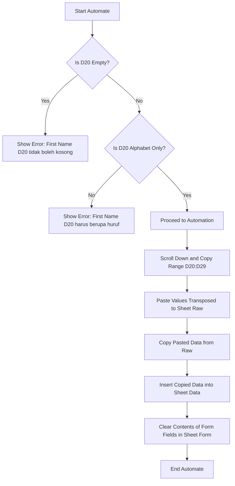

## Pendahuluan
**_"Excel is more than just cells and formulas — it’s a gateway to solving real-world business problems."_**

Dalam portofolio ini, saya membagikan projects Excel, di mana saya menggabungkan teknik analisis data, VBA, dan desain dashboard untuk menangani tantangan di bidang keuangan, akuntansi, dan manajemen procurement. 

## Excel Advanced Techniques
- Financial modeling (e.g., Break-Even Analysis, ROI Calculator)
- Data cleaning automation (FlasFill, TEXTJOIN, Power Query)
- Dynamic reports dengan INDEX-MATCH dan OFFSET
- Interactive data validation dashboard

## Macro (VBA) Automation
### Studi Kasus: Form Registrasi Peserta Bekasi Big Tech Conference

{: width="478" height="339" .center}

**Tools & Metodologi**
- **Teknologi:**
  - **VBA Macro:** Otomatisasi proses input dan validasi data.
  - **Data Validation:** Memastikan format input sesuai kriteria (huruf, angka, dll).
  - **Form Control:** Tombol (_Button_), _Option Button_ , dan proteksi sel (_Lock Cell_) untuk antarmuka pengguna.
- **Fungsi Utama:**
  - `If`, `Value`, `Transpose`: Manipulasi data dan logika validasi.
  - _Error Handling_: Pengecekan kosong/nilai tidak valid dengan pesan interaktif.

---
Flowchart:


**Penjelasan Singkat:**
1. Validasi kolom **First Name (D20)**:
  - Cek kekosongan → validasi alfabet → lanjut ke otomatisasi.
2. **Proses data:**
  - Salin data → tempel transpos ke sheet "Raw" → integrasikan ke sheet "Data".
3. Reset form setelah data tersimpan.

---

**Error Handling (Code VBA):**

Kode berikut memastikan input First Name hanya berisi huruf dan tidak kosong:

```vb
' Validasi First Name (D20)
Dim firstName As String
firstName = Trim(CStr(Range("D20").Value)) ' Hapus spasi berlebih

If firstName = "" Then
    MsgBox "First Name (D20) tidak boleh kosong!", vbExclamation, "Input Error"
    Exit Sub
ElseIf Not IsAlphabet(firstName) Then
    MsgBox "First Name (D20) harus berupa huruf (string)!", vbExclamation, "Input Error"
    Exit Sub
End If

' Fungsi pemeriksa alfabet
Function IsAlphabet(inputString As String) As Boolean
    Dim i As Integer, char As String
    For i = 1 To Len(inputString)
        char = Mid(inputString, i, 1)
        If Not ((char >= "A" And char <= "Z") Or (char >= "a" And char <= "z")) Then
            IsAlphabet = False
            Exit Function
        End If
    Next i
    IsAlphabet = True
End Function
```
**Fitur Utama Sistem**
1. **Validasi Real-Time:**
  - Deteksi input kosong atau non-alfabet seketika.
2. **Otomatisasi Data:**
  - Transpose data dari form ke database dengan sekali klik.
3. **Proteksi Data:**
  - Kunci sel penting dan proteksi sheet untuk mencegah perubahan tidak sengaja.

## Financial Analysis
### Studi Kasus: Budget vs Actual Variance Analysis

**Tools & Metodologi**
- **Title:** Sales Performance: Actual, Previous Year, Budget, Year over Year Variance.
- **Teknik Analisis:** _Variance analysis_ (perbandingan aktual vs anggaran dan tahun sebelumnya)
- **Rumus Utama:**
  - `XLOOKUP` dan Nested XLOOKUP untuk integrasi data multidimensi.
  - Fungsi `MONTH` dan `TODAY` untuk pemrosesan data waktu-nyata.
  - Perhitungan _percentage change_ dan _data validation_ untuk akurasi.
- **Visualisasi:** Chart interaktif menggunakan **Zebra BI** dan grafik dinamis.

> **Raw Dataset**: [Sales Performance](https://github.com/alamdz/projects-files/blob/5b47b0d83b08099acbe6950ef440ca361862cd20/excel/variance%20analysis.xlsx){:target="_blank"}

**Dataset & Struktur:**

| Komponen                     | Detail           |
| :--------------------------- | :--------------- |
| Data Actual                  | 351 Rows, 4 Columns (Year, Month, Store Location, Sales) |
| Data Plan                    | 12 Rows, 12 Columns (Store Location, Jan - Dec, Sales) |
| Key Variabel                 | Year, Month, Store Location, Sales, Plan, Pertumbuhan (%) |

{: width="478" height="339" .center}

{: width="478" height="339" .center}

**Dashboard**
- **Fungsi** :
  - Membandingkan kinerja penjualan aktual vs rencana (ΔPY%) dan vs tahun sebelumnya (ΔPL%).
  - Menyoroti tren bulanan dan perbandingan antar wilayah.
- **Fitur** :
  - _Drill-down_ berbasis lokasi menggunakan Zebra BI.
  - _Highlight_ otomatis untuk varian signifikan (>10%).

**Insight:**
  1. **Lokasi Berkinerja Tinggi**
  - **DKI Jakarta:**
    - Pertumbuhan +15.2% YoY (dampak strategi New CEO).
    - Gap -7.0% vs rencana, perlu optimisasi alokasi anggaran.
  - **Jawa Barat:**
    - Melebihi rencana +10.5% (strategi New Sales Force efektif).
    - Pertumbuhan YoY +13.4%.
  2. **Lokasi Prioritas Perbaikan:**
  - **Bali:** 
    - Penurunan tajam -20.5% YoY akibat "Low Demand".
    - Di bawah rencana -15.6% – perlu analisis pasar ulang.
  - **Nusa Tenggara:**
    - Penurunan -8.2% YoY dan -6.6% vs rencana – evaluasi strategi distribusi.
  3. **Lokasi Stabil**
  - **Jawa Tengah & Yogyakarta:**
    - Konsisten melampaui rencana (+5.7% s/d +7.5%).
    - Potensi replikasi strategi ke wilayah lain.

### Cash flow forecasting model
### Investment appraisal tools (NPV/IRR calculator)
### Break-even analysis untuk studi kasus bisnis
<!-- https://www.youtube.com/watch?v=lHk6MdGAfw8&t=907s -->
## Accounting Solutions
- Automated journal entry template
- Bank reconciliation system
- Depreciation calculator (SLD/DDB methods)
- Link antara General Ledger ↔ Financial Statements

## Procurement Management
- Vendor comparison matrix dengan weighted scoring
- Purchase Order tracker dengan approval workflow
- Spend analysis dashboard (ABC analysis)
- Inventory management system

## Interactive Dashboard
- KPI tracker dengan slicer & timeline control
- Sales performance dashboard (PivotTable + Power Pivot)
- Real-time update menggunakan tabel dinamis
- Data visualization best practices (kapan gunakan bar/line/pie chart)

<!-- https://www.youtube.com/watch?v=lHk6MdGAfw8 -->
<!-- https://www.youtube.com/watch?v=7gG0Evugubo -->
<!-- https://www.youtube.com/watch?v=Ko-rlDWPTNg -->