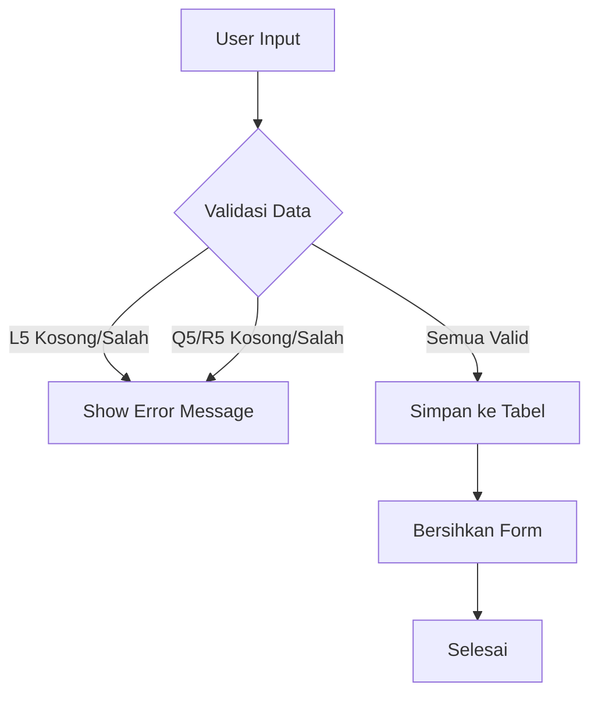

<!-- https://www.youtube.com/watch?v=UlAoSqR-cDQ -->
<!-- https://www.youtube.com/watch?v=dahrmqT5GD4&t=4366s -->

## Pendahuluan
Proyek ini bertujuan menganalisis kinerja penjualan ritel untuk mengidentifikasi pola, risiko, dan peluang bisnis. Dengan menggabungkan teknik analisis data di Excel dan visualisasi di Tableau, tim dapat:
1. Memonitor efisiensi rantai pasok (contoh: lama pengiriman).
2. Mengoptimalkan strategi penjualan berdasarkan kategori produk terlaris.
3. Memprediksi risiko retur pesanan berdasarkan data historis.

> **Raw Dataset**: [**Dataset Retail Store Sales**](https://github.com/alamdz/projects-files/blob/a4c3f4ad167084aa5a8251fc65962f231a0a8963/excel/retail_sales_summary.xlsx){:target="_blank"}

Dataset: `556 baris, 12 kolom, 2 sheet`
Variabel Utama: `Order ID, Customer Name, Product Category, Product Name, Order Date, Delivered Date, Quantity, Unit Price, Status, Country, Payment Method dan Cost Percentage`

### Tools & Metodologi
#### **A. Excel**
1. **Data Preparation**:
- **Pembersihan Data:**
    - Format ulang tanggal, hapus duplikat, dan isi missing value dengan rata-rata.
    - Standarisasi teks menggunakan `TRIM` dan `PROPER`.
- **Transformasi Data:**
    - Tambahkan kolom `Year`, `Month`, `Day`, `Delivery Time`, dll.
    - Hitung `Sales Revenue`, `Net Profit`, dan `Cost Percentage` dengan rumus Excel.
2. **Statistical Analysis:**
- **Descriptive Statistics:** Ringkasan statistik (rata-rata, standar deviasi) untuk kolom kritis.
- **Uji t-Test:** Analisis perbedaan signifikan antara lama pengiriman pesanan "Completed" vs "Returned".
3. **Otomatisasi:**
- `VBA Macro:` Form input dinamis dengan validasi data (teks, angka) dan _error handling_.

#### **B. Tableau**
- **Visualisasi:**
    - Line chart untuk tren penjualan bulanan.
    - Bar chart untuk kategori produk dengan pendapatan tertinggi.
    - Heatmap untuk distribusi waktu pengiriman.
- **Interaksi:**
    - Filter berdasarkan negara, metode pembayaran, atau rentang tanggal.
    - Dashboard interaktif untuk presentasi ke stakeholder.

## Data Processing in Excel
### A. Pembersihan Data
- **Format Tanggal:**
    - Konversi format numerik (contoh: `45432`) ke `Short Date` untuk kolom `Order Date` dan `Delivered Date`.
- **Data Duplikat:**
    - Menghapus baris duplikat menggunakan `Data > Remove Duplicates`.
- **Missing Value:**
    - Mengisi sel kosong di kolom numerik dengan rata-rata menggunakan _Descriptive Statistics_.
    - Menggunakan `TRIM` dan `PROPER` untuk membersihkan teks (contoh: `"jakarta" → "Jakarta"`).

### B. Transformasi Data
- **Kolom Baru:**
Tahun, Bulan, Hari : Ekstrak dari `Order Date` menggunakan fungsi `TEXT`, `YEAR`, `MONTH`, `DAY`.
- **Delivery Time:**
```
= DATEDIF(Order_Date, Delivered_Date, "d") 
or
=ABS([@[Order Date]]-[@[Delivered Date]])
```
- **Sales Revenue & Net Profit:**
```
Sales Revenue = Quantity * Unit Price  
Net Profit = Sales Revenue * (1 - Cost Percentage)
```
{: .center}

### C. Ringkasan Statistik
- **Tool:** Data Analysis > Descriptive Statistics .
- **Output:**
    - Rata-rata `Delivery Time`: 7.84 hari
    - Total `Net Profit`: $514.299
    - Standar deviasi `Sales Revenue`: $2.198

{: .center}

## Analisis Statistik: Uji Hipotesis
### Skenario:
Apakah ada hubungan antara lama pengiriman dan status pesanan (`Completed` vs `Returned`)?

### Hipotesis:
- **H₀ (Null Hypothesis)**: Tidak ada perbedaan signifikan antara lama pengiriman pesanan "Completed" dan "Returned".
- **H₁ (Alternative Hypothesis)**: Pesanan yang dikembalikan memiliki waktu pengiriman lebih lama daripada pesanan yang selesai.

### Metode:
- **Uji t-Test: Two-Sample Unequal Variances**
    - Kelompok 1: `Delivery Time` untuk pesanan "`Completed`".
    - Kelompok 2: `Delivery Time` untuk pesanan "`Returned`".

{: .center}

### Hasil:
- **t-Stat**: -5.53 (nilai negatif menunjukkan arah perbedaan: Returned > Completed)
- **p-Value (two-tail)**: **4.96E-08**(<< 0.05)
- **t Critical (two-tail)**: ±1.96

### Interpretasi:
1. **Keputusan Statistik**:
    - Karena **p-Value (4.96E-08) << 0.05**, kita **tolak H₀**.
    - Perbedaan lama pengiriman antara kedua kelompok signifikan secara statistik .
2. **Arti Bisnis**:
    - Pesanan yang **dikembalikan** membutuhkan waktu pengiriman **1.79 hari lebih lama** dibandingkan pesanan yang selesai.
    - **Risiko Retur:** Semakin lama pengiriman, semakin tinggi kemungkinan pelanggan mengajukan retur.

### Rekomendasi Tindakan:
1. **Pantau Pesanan Kritis:**
- Tetapkan batas waktu pengiriman maksimal **7 hari** untuk mengurangi risiko retur.
2. **Optimasi Logistik:**
- Kolaborasi dengan mitra kurir untuk mempercepat proses pengiriman di wilayah dengan tingkat retur tinggi.
3. **Sistem Peringatan:**
- Buat notifikasi otomatis untuk pesanan yang melebihi 6 hari pengiriman.
4. **Analisis Lanjutan:**
- Identifikasi penyebab keterlambangan (contoh: stok barang, kinerja kurir).

## Otomatisasi Form Input dengan VBA
**Tujuan**: Membuat form input dinamis di Excel untuk memastikan data yang masuk ke tabel valid, konsisten, dan bebas kesalahan.

### Fitur Utama Form
1. **Validasi Data:**
- **Kolom "Customer Name" (L5)**:
    - Wajib diisi (`Not Empty`).
    - Harus berupa teks (bukan angka/simbol).
- **Kolom "Quantity" (Q5) & "Unit Price" (R5)**:
    - Wajib diisi dengan angka (`IsNumeric`).
    - Mencegah input non-numerik (contoh: teks atau simbol).

2. **Error Handling**:
- Pesan peringatan muncul jika input tidak sesuai (contoh: `Cell L5 tidak boleh kosong!`).
- Proses dihentikan hingga semua input valid.

3. **Penyimpanan Data**:
- Data otomatis disimpan ke tabel `Retail Store Sales` dalam format yang konsisten.
- Form dibersihkan setelah penyimpanan untuk input berikutnya.

### Tampilan Form
{: .center}

---

### Alur Kerja Form


---

### Kode VBA dan Penjelasan
```vb
Sub saveform()
    'Deklarasi variabel
    Dim wsForm As Worksheet, wsData As Worksheet
    Dim tbl As ListObject
    Dim NewRow As ListRow
    Dim IsValid As Boolean
    
    'Inisialisasi worksheet dan tabel
    Set wsForm = ThisWorkbook.Sheets("Form")
    Set wsData = ThisWorkbook.Sheets("Retail Store Sales")
    Set tbl = wsData.ListObjects("Table1") 'Sesuaikan nama tabel
    
    'Validasi data
    IsValid = True
    
    'Validasi L5 (harus string tidak kosong)
    If wsForm.Range("L5").Value = "" Then
        MsgBox "Cell L5 tidak boleh kosong!", vbExclamation
        IsValid = False
    ElseIf IsNumeric(wsForm.Range("L5").Value) Then
        MsgBox "Cell L5 harus berisi teks/string!", vbExclamation
        IsValid = False
    End If
    
    'Validasi Q5 dan R5 (harus angka)
    If wsForm.Range("Q5").Value = "" Or Not IsNumeric(wsForm.Range("Q5").Value) Then
        MsgBox "Cell Q5 harus diisi dengan angka!", vbExclamation
        IsValid = False
    End If
    If wsForm.Range("R5").Value = "" Or Not IsNumeric(wsForm.Range("R5").Value) Then
        MsgBox "Cell R5 harus diisi dengan angka!", vbExclamation
        IsValid = False
    End If
    
    'Hentikan proses jika ada error
    If Not IsValid Then Exit Sub
    
    'Tambahkan baris baru di tabel
    Set NewRow = tbl.ListRows.Add(AlwaysInsert:=True)
    
    'Copy data dari form ke tabel
    With wsForm
        .Range("L5:V5").Copy
        NewRow.Range.Cells(1, 1).PasteSpecial xlPasteValues
        Application.CutCopyMode = False
    End With
    
    'Bersihkan form
    With wsForm
        .Range("D6,D8,D10,D12,D14,G6,G8,G10,G12,G14").ClearContents
        .Range("L5").Select
    End With
    
    MsgBox "Data berhasil disimpan!", vbInformation
End Sub
```

### Penjelasan Kode:
1. **Struktur Logis:**
- Kode menggunakan `Boolean` (`IsValid`) untuk memastikan semua validasi terpenuhi sebelum penyimpanan.
- Validasi dilakukan bertahap untuk setiap kolom kritis.
2. **Keamanan Data:**
- `IsNumeric` mencegah input tidak valid (contoh: huruf di kolom numerik).
- `ClearContents` membersihkan form setelah penyimpanan untuk menghindari duplikasi.
3. **Integrasi Tabel:**
- Data disimpan ke tabel Excel (`ListObject`) untuk konsistensi format.

## Visualisasi dengan Tableau
Tujuan: Membangun dashboard interaktif untuk memantau kinerja penjualan, profitabilitas, dan pola pelanggan.

### 1. KPI Card
- Menampilkan total `Sales Revenue` , `Net Profit` , dan jumlah pelanggan (`# of Customer`).
- Contoh:
    - Sales Revenue: $1.471.511
    - Net Profit: $514.299
    - Jumlah Pelanggan: 555

### 2. Sales by Country
- Lokasi negara dengan label `Sales Revenue`.
- Negara dengan revenue tertinggi: `Nigeria`.

### 3. Bar Chart by Product Category
- Membandingkan Sales Revenue dan Net Profit per kategori produk.
- Kategori Apparel paling laris, tapi profitnya rendah.

### 4. Net Profit by Month
- Grafik garis untuk memantau Net Profit tiap bulan.

### 5. Sales by Product
- Tampilkan produk dengan Sales Revenue di atas atau dibawah rata-rata.
- Produk di atas rata-rata diberi warna.
```
IF SUM([Sales Revenue]) >= WINDOW_AVG(SUM([Sales Revenue]))
```

### Tampilan Dashboard
{: .center}

- **Insight**:
    - Negara dengan revenue terkecil adalah `Antarctica`
    - Profit turun di bulan May-Agustus → perlu cek biaya operasional.

- **Saran**:
    - Tingkatkan margin keuntungan untuk kategori `Electronics` dan `Home Decor`.
    - Produk dengan revenue rendah perlu promo atau diskon.